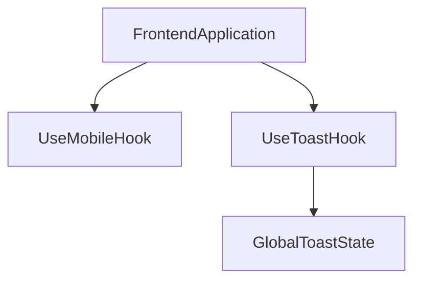

# REPOSITORY_OVERVIEW.md

> **Source File:** [REPOSITORY_OVERVIEW.md](https://github.com/quelizlifetech/UltraHand/blob/main/REPOSITORY_OVERVIEW.md)
> **Repository:** `UltraHand`
> **Branch:** `main`

# UltraHand — Repository Overview

### High-Level Purpose
The `UltraHand` repository, based on the provided frontend components, appears to be focused on building a client-side application with a strong emphasis on responsive user interface design and consistent notification mechanisms. Its primary objective is to deliver a dynamic and adaptable user experience.

### Architectural Structure
The repository structure, as inferred from the available files, indicates a frontend-centric architecture, specifically within a React ecosystem. The `frontend/src/hooks` directory suggests an organization pattern that promotes reusable, encapsulated logic for UI concerns. This implies a modular approach to client-side development, where common functionalities are abstracted into custom hooks.

### Core Components
*   **Responsive UI Utilities**: The `use-mobile` hook provides a mechanism for components to react to viewport size changes, enabling responsive layouts and content adaptation.
*   **Global Toast Notification System**: The `use-toast` hook and associated utilities implement a global, singleton state management pattern for displaying transient UI notifications (toasts), ensuring consistent messaging across the application.

### Interaction & Data Flow
At a high level, components within the frontend application consume the provided hooks. The `useIsMobile` hook provides reactive state updates based on browser viewport dimensions. The `useToast` hook allows components to imperatively trigger toast notifications, which are then managed by a global state store using a dispatch-reducer pattern. This global state updates subscribed components, leading to reactive rendering of toasts.

### Technology Stack
The project primarily utilizes:
*   **React**: For building the user interface, leveraging custom hooks (`useState`, `useEffect`).
*   **TypeScript**: Ensuring type safety and improving developer experience across the codebase.
*   **Browser APIs**: Specifically `window.matchMedia` and `window.innerWidth` for responsive design logic.
*   **Internal UI Components**: Indicated by imports like `@/components/ui/toast`, suggesting a reliance on a local or shared UI component library.

### Design Observations
The design prioritizes client-side performance and maintainability through:
*   **Efficient Responsive Design**: Using `window.matchMedia` for responsive logic avoids less performant `resize` event listeners.
*   **Centralized State Management for Toasts**: A custom global singleton store for toasts centralizes notification logic, reducing prop drilling and ensuring consistency.
*   **Predictable State Transitions**: The use of a reducer pattern for toast state management promotes predictable updates, although the `use-toast` implementation notes side effects within the reducer.
*   **Controlled Toast Visibility**: The `TOAST_LIMIT` of 1 for toasts suggests a design choice to minimize UI clutter by allowing only one toast to be visible at a time, with an emphasis on explicit dismissal.

### System Diagram
