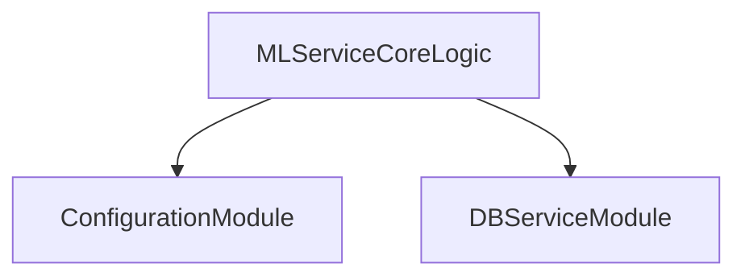

# REPOSITORY_OVERVIEW.md

> **Source File:** [REPOSITORY_OVERVIEW.md](https://github.com/quelizlifetech/UltraHand/blob/main/REPOSITORY_OVERVIEW.md)
> **Repository:** `UltraHand`
> **Branch:** `main`

# UltraHand — Repository Overview

### High-Level Purpose
The UltraHand repository appears to house an ML service primarily focused on machine learning-driven patient therapy planning and management. Its objective is to define and apply machine learning models, generate adaptive therapy plans based on patient recovery, and manage related session data.

### Architectural Structure
The repository is structured with a distinct `ml-service` directory, indicating a modular component dedicated to machine learning operations. Within this service, an explicit separation of concerns is observed:
*   **Configuration Layer**: Handled by `config.py`, centralizing all static parameters.
*   **Data Access Layer**: Managed by `db_service.py`, abstracting persistence operations.
This structure suggests that other ML-specific logic (e.g., model training, prediction, therapy plan generation) would reside within this `ml-service` and utilize these foundational modules.

### Core Components
*   **Configuration Module (`ml-service/config.py`)**: Defines all operational parameters for the ML service, including dataset paths, model storage, feature engineering specifications, joint angle analysis parameters, and detailed, phase-based therapy mode progression rules.
*   **Database Service Module (`ml-service/db_service.py`)**: Provides an interface for interacting with a persistence layer, primarily for patient session data. It is currently implemented in a "stub mode" for development, simulating database operations without an active connection.

### Interaction & Data Flow
Components within the `ml-service` are designed to interact as follows:
*   Other ML processing or therapy generation modules (not detailed in the provided summaries) import and consume parameters from the `config.py` module.
*   These modules also interact with the `db_service.py` module to store new patient session data or retrieve existing records.
*   In its current stubbed state, `db_service.py` logs operations and returns default empty data, preventing actual data persistence or retrieval. The overall flow is driven by the ML service's core logic, which is configured by `config.py` and uses `db_service.py` for data persistence.

### Technology Stack
*   **Core Language**: Python.
*   **Data Manipulation**: `pandas` is used for handling tabular data, particularly for representing fetched session records.
*   **Logging**: The standard `logging` module is integrated for operational insights and debugging.
*   **Planned Persistence**: Future integration with `PostgreSQL` via the `psycopg2` adapter is indicated for robust data storage.

### Design Observations
*   **Centralized Configuration**: The `config.py` file consolidates all service parameters, promoting consistency and ease of management.
*   **Abstracted Data Access**: `db_service.py` provides a clean separation between business logic and data persistence, facilitating database changes or mock implementations.
*   **Development-Friendly Stubbing**: The "stub mode" in `db_service.py` allows for local development and testing of the ML service without requiring a live PostgreSQL instance, though it implies that actual database interaction logic is not yet fully tested.
*   **Granular Therapy Planning**: The detailed structure for `THERAPY_MODE_PROGRESSION` and `MODE_INTENSITY_STEPS` in `config.py` reflects an intention for highly adaptive and personalized patient therapy plans.
*   **Future-Proofing**: The commented-out database configurations and `psycopg2` imports clearly outline a planned migration to a persistent PostgreSQL backend.

### System Diagram

