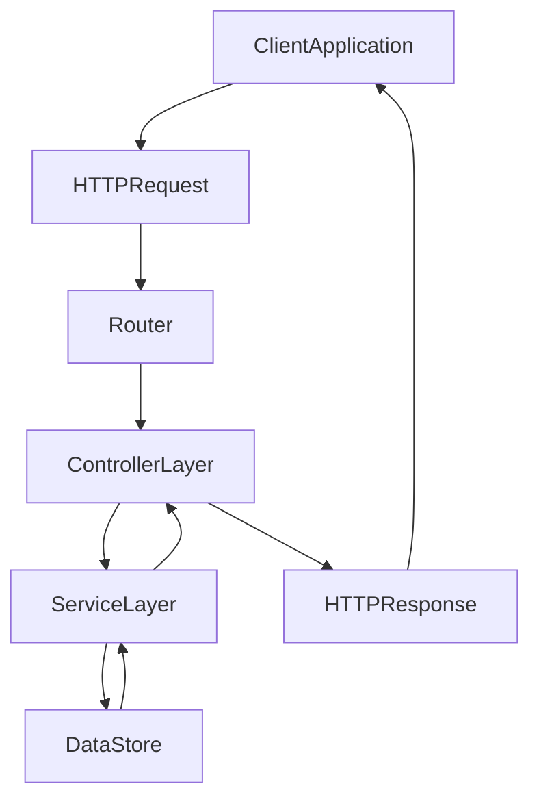

# REPOSITORY_OVERVIEW.md

> **Source File:** [REPOSITORY_OVERVIEW.md](https://github.com/quelizlifetech/UltraHand/blob/main/REPOSITORY_OVERVIEW.md)
> **Repository:** `UltraHand`
> **Branch:** `main`

# UltraHand — Repository Overview

### High-Level Purpose
The UltraHand repository appears to implement a backend system designed for managing healthcare-related data, specifically focusing on user authentication (doctors), patient management, and an alert system. Its primary objective is to provide API endpoints for these functionalities, supporting interactions between medical staff and patient data.

### Architectural Structure
The repository exhibits a clear layered backend architecture, primarily structured around:
*   `backend/src/controllers`: Handles incoming HTTP requests, extracts data, and delegates business logic.
*   `backend/src/services`: Encapsulates core business logic and interacts with data storage (inferred).

This structure promotes separation of concerns, with controllers managing the request/response cycle and services handling domain-specific operations.

### Core Components
The primary subsystems identified are:
*   **Authentication Module:** Manages user registration (doctors), login, current user retrieval, and a multi-step password reset process involving OTP verification.
*   **Alert Management Module:** Provides functionalities to retrieve alerts, specifically tailored for authenticated doctors and individual patients.

### Interaction & Data Flow
Clients (e.g., a frontend application) initiate HTTP requests to the backend. These requests are routed to specific controller functions (e.g., `auth.controller.js`, `alert.controller.js`). The controllers:
1.  Receive the HTTP request.
2.  Extract relevant data (e.g., request body, URL parameters, user ID from authentication middleware).
3.  Delegate the core business logic to the corresponding service layer module (e.g., `auth.service`, `alert.service`).
4.  Await the result from the service.
5.  Format the response (typically JSON) and send it back to the client.

The service layer is responsible for executing business rules, interacting with data persistence, and returning processed data or status to the controllers.

### Technology Stack
Based on the JavaScript files and common backend patterns:
*   **Runtime:** Node.js (inferred from `.js` files and `async/await` usage).
*   **Language:** JavaScript (ESNext features like `async/await`).
*   **Framework:** An HTTP server framework (e.g., Express.js, though not explicitly stated, is common for this pattern).
*   **Authentication:** Relies on an implicit authentication middleware to populate `req.user.id`.
*   **Password Reset:** Implements a token-based (OTP) multi-step password recovery mechanism.

### Design Observations
*   **Separation of Concerns:** A strong adherence to the controller-service pattern is evident, clearly separating HTTP concerns from business logic.
*   **Asynchronous Operations:** Extensive use of `async/await` indicates that the application is designed to handle I/O-bound operations efficiently without blocking the event loop, typical for database interactions or external API calls.
*   **Modularity:** The organization into distinct `controllers` and `services` directories promotes modularity, making the codebase easier to understand, maintain, and test.
*   **Implicit Middleware:** The reliance on `req.user.id` suggests the presence of an authentication middleware that processes requests before they reach the controllers.
*   **Error Handling (Inferred):** While not explicitly shown in the snippets, the absence of `try-catch` blocks in controllers implies that a global error handling middleware is likely in place to catch exceptions from the service layer and send appropriate HTTP error responses.

### System Diagram
