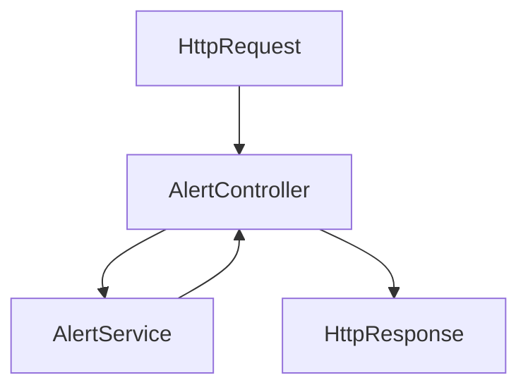

# backend/src/controllers/alert.controller.js

> **Source File:** [backend/src/controllers/alert.controller.js](https://github.com/quelizlifetech/UltraHand/blob/main/backend/src/controllers/alert.controller.js)
> **Repository:** `UltraHand`
> **Branch:** `main`

# backend/src/controllers/alert.controller.js

### Overview
This file defines controller functions responsible for handling API requests related to alerts. It acts as an interface between the HTTP request layer and the `alert.service` module.

### Architecture & Role
This file is part of the `controllers` layer within the backend architecture. Its primary role is to:
- Receive incoming HTTP requests routed to specific alert endpoints.
- Extract relevant data from the request object (e.g., user ID, patient ID).
- Delegate the core business logic to the `alert.service` layer.
- Format and send the response back to the client in JSON format.
It sits between the routing layer and the service layer.

### Key Components
- `svc`: An imported instance of the `alert.service` module, providing functions for alert-related business logic.
- `exports.doctor`: An asynchronous controller function designed to retrieve alerts specific to the authenticated doctor. It expects the doctor's ID to be available in `req.user.id`.
- `exports.patient`: An asynchronous controller function for fetching alerts associated with a particular patient. It expects the `patientId` to be provided as a route parameter in `req.params.patientId`.

### Execution Flow / Behavior
1. An HTTP request targeting an alert endpoint is received by the application's router and directed to either the `doctor` or `patient` controller function.
2. The selected controller function extracts the necessary identifier (doctor ID from `req.user.id` or patient ID from `req.params.patientId`).
3. It then invokes the corresponding asynchronous method on the `svc` (alert service): `svc.doctorAlerts` or `svc.patientAlerts`.
4. The controller awaits the result returned by the service method, which encapsulates the application's business logic and data retrieval.
5. Finally, the controller sends the received data back to the client as a JSON response using `res.json()`.

### Dependencies
- `../services/alert.service`: An internal dependency providing the business logic for retrieving doctor-specific and patient-specific alerts. The controller relies entirely on this service for data operations.

### Design Notes
- **Separation of Concerns:** The file demonstrates a clear separation of concerns by delegating business logic to a service layer, adhering to the controller-service pattern. Controllers manage request/response, while services handle core domain logic.
- **Asynchronous Operations:** The use of `async/await` throughout indicates that these functions handle potentially long-running I/O operations, typically associated with database interactions in the service layer.
- **Implicit Context:** The reliance on `req.user.id` suggests that an authentication middleware is executed prior to these controllers, populating the `req.user` object with the authenticated user's details.

### Diagram
