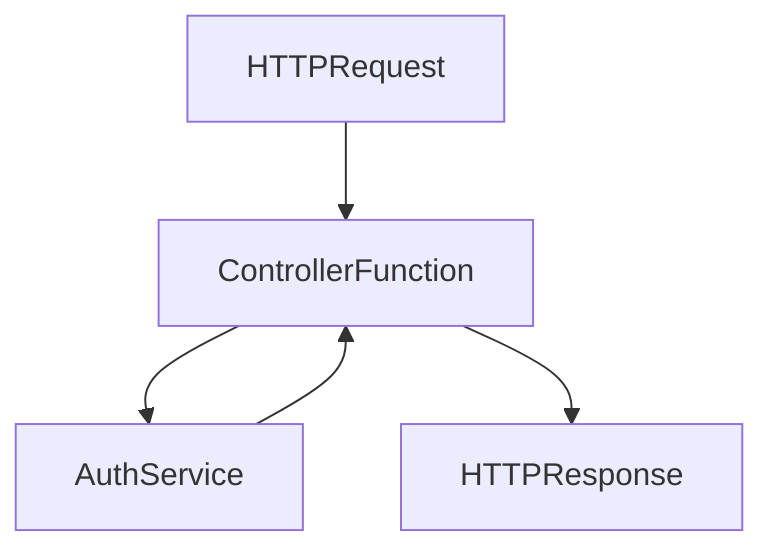

# backend/src/controllers/auth.controller.js

> **Source File:** [backend/src/controllers/auth.controller.js](https://github.com/quelizlifetech/UltraHand/blob/main/backend/src/controllers/auth.controller.js)
> **Repository:** `UltraHand`
> **Branch:** `main`

# backend/src/controllers/auth.controller.js

### Overview
This file defines controller functions responsible for handling authentication and user management HTTP requests. It acts as the entry point for API routes related to user registration, login, current user retrieval, and the multi-step password reset process.

### Architecture & Role
This file is part of the controller layer within the backend application's architecture. Its role is to:
*   Receive incoming HTTP requests from clients.
*   Extract necessary data from the request object (`req.body`, `req.user.id`).
*   Delegate the execution of business logic to the `auth.service` module.
*   Format the service's response and send it back to the client as an HTTP response.

### Key Components
The file exports the following asynchronous functions, each corresponding to a specific API endpoint:
*   `registerDoctor(req, res)`: Handles the registration of new doctor accounts.
*   `login(req, res)`: Manages user authentication and session creation.
*   `me(req, res)`: Retrieves profile information for the currently authenticated user.
*   `forgotPassword(req, res)`: Initiates the password recovery process by requesting a One-Time Password (OTP).
*   `verifyOtp(req, res)`: Validates the provided OTP during the password recovery flow.
*   `resetPassword(req, res)`: Completes the password recovery by setting a new password.

### Execution Flow / Behavior
Each exported controller function operates similarly:
1.  An HTTP request invokes a specific controller function (e.g., `registerDoctor`).
2.  The function calls the corresponding method on the `svc` (authentication service) object, passing relevant request data.
3.  It `await`s the result from the service layer, which encapsulates the business logic and data access.
4.  Upon receiving data from the service, the controller sends it back to the client as a JSON response.
    *   `registerDoctor` explicitly sets the HTTP status to `201 Created`.
    *   Other functions implicitly send a `200 OK` status.

### Dependencies
*   `../services/auth.service` (imported as `svc`): This is the primary dependency, providing the core business logic for all authentication operations. The controller offloads all processing beyond request parsing and response formatting to this service.

### Design Notes
*   **Separation of Concerns**: The file strictly adheres to the controller's role by focusing on HTTP request/response handling and delegating all application logic to the `auth.service`. This promotes modularity and testability.
*   **Asynchronous Operations**: All functions are `async`, reflecting that underlying service operations likely involve I/O (e.g., database interactions, external API calls) and should not block the event loop.
*   **Password Reset Workflow**: The explicit `forgotPassword`, `verifyOtp`, and `resetPassword` functions indicate a multi-step, token-based password recovery mechanism designed for security.
*   **Error Handling**: The provided code snippet does not include explicit `try-catch` blocks within the controller functions. It is assumed that error handling from the service layer and subsequent HTTP error responses are managed by a global error handling middleware or similar mechanism.

### Diagram
