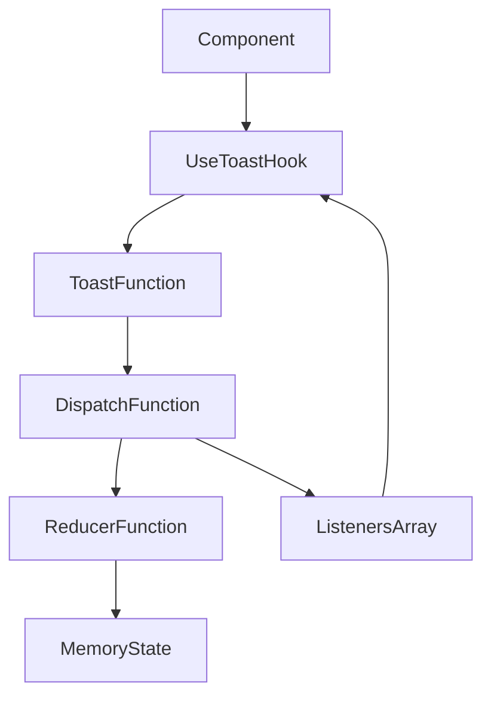

# frontend/src/hooks/use-toast.ts

> **Source File:** [frontend/src/hooks/use-toast.ts](https://github.com/quelizlifetech/UltraHand/blob/main/frontend/src/hooks/use-toast.ts)
> **Repository:** `UltraHand`
> **Branch:** `main`

# frontend/src/hooks/use-toast.ts

### Overview
This file provides a React hook (`useToast`) and an associated utility function (`toast`) for managing and displaying transient UI notifications (toasts) across the application. It implements a global, singleton state management pattern to ensure all toast instances reflect the same state.

### Architecture & Role
This file operates within the frontend UI layer, specifically as a custom React hook. It serves as a client-side state management module responsible for the lifecycle of toast notifications, from creation and updating to dismissal and removal. It abstracts the underlying state logic, allowing components to imperatively trigger toasts and reactively display them.

### Key Components
*   `TOAST_LIMIT`: A constant defining the maximum number of toasts that can be displayed simultaneously. Currently set to `1`.
*   `TOAST_REMOVE_DELAY`: A constant specifying the delay before a dismissed toast is removed from the state. Set to a very large value (1,000,000ms), implying toasts are not automatically removed by default unless explicitly dismissed.
*   `ToasterToast`: A type alias extending `ToastProps` with an `id` and optional `title`, `description`, and `action`, representing the structure of a toast object.
*   `actionTypes`, `Action`: Defines the possible actions (`ADD_TOAST`, `UPDATE_TOAST`, `DISMISS_TOAST`, `REMOVE_TOAST`) that can modify the toast state, following a Redux-like pattern.
*   `State`: An interface defining the global state, containing an array of `ToasterToast` objects.
*   `genId()`: A utility function to generate unique string IDs for toasts.
*   `toastTimeouts`: A `Map` used to store and manage `setTimeout` references for scheduled toast removals.
*   `addToRemoveQueue(toastId)`: A function that schedules a `REMOVE_TOAST` action for a given toast ID after `TOAST_REMOVE_DELAY`.
*   `reducer(state, action)`: The core state management logic, which takes the current state and an action, returning a new state.
*   `listeners`: An array of callback functions subscribed to state changes.
*   `memoryState`: The global, singleton state object for all toasts.
*   `dispatch(action)`: The central function to update `memoryState` via the `reducer` and notify all `listeners`.
*   `toast({ ...props }: Toast)`: An imperative function to create and add a new toast, returning an object with the toast's `id`, `dismiss`, and `update` methods.
*   `useToast()`: The primary React hook that provides access to the current toast state (`toasts` array) and global `toast` and `dismiss` functions. It subscribes the consuming component to state updates.

### Execution Flow / Behavior
1.  **Initialization**: `memoryState` is initialized as an empty array of toasts.
2.  **Toast Creation**: When `toast({ ...props })` is called, a unique `id` is generated. An `ADD_TOAST` action is dispatched via `dispatch`, which updates `memoryState` using the `reducer`.
3.  **State Update & Rendering**: After `memoryState` is updated, `dispatch` iterates through `listeners` and invokes each subscribed callback. Components using `useToast` will have their `setState` callback in `listeners`, triggering a re-render with the new toast state.
4.  **Toast Dismissal**:
    *   Calling `dismiss()` (returned by `toast`) or `dismiss(toastId)` (returned by `useToast`) dispatches a `DISMISS_TOAST` action.
    *   The `reducer` for `DISMISS_TOAST` sets the `open` property of the target toast(s) to `false` and calls `addToRemoveQueue` to schedule its eventual removal.
    *   The `onOpenChange` callback, attached to each toast during creation, also dispatches a `dismiss` action if the toast component signals it's no longer open.
5.  **Toast Removal**: When `TOAST_REMOVE_DELAY` passes after a toast is dismissed, `addToRemoveQueue` dispatches a `REMOVE_TOAST` action. The `reducer` then filters the toast out of `memoryState`.
6.  **Hook Lifecycle**: `useToast` uses `React.useEffect` to subscribe its `setState` function to the global `listeners` array on mount and removes it on unmount, ensuring components re-render only when the global toast state changes.

### Dependencies
*   `react`: Core dependency for React hooks (`useState`, `useEffect`) and `React.ReactNode` type.
*   `@/components/ui/toast`: Imports types `ToastActionElement` and `ToastProps`, indicating reliance on a shared UI component library or internal component for the actual toast rendering properties.

### Design Notes
*   **Global Singleton State**: The implementation uses a custom, non-React-context-based global singleton store (`memoryState`, `dispatch`, `listeners`) for toast management. This allows any part of the application to interact with toasts without prop drilling or explicit context providers.
*   **Reducer Pattern**: A `reducer` function is used for predictable state transitions, centralizing state modification logic.
*   **Side Effects in Reducer**: The `DISMISS_TOAST` action within the `reducer` directly calls `addToRemoveQueue`, which is a side effect (setting a timeout). While noted in the code, this deviates from pure reducer principles.
*   **Toast Limit**: The `TOAST_LIMIT` of `1` suggests that only one toast should be visible at any given time, with new toasts replacing older ones.
*   **Manual Removal Emphasis**: The extremely large `TOAST_REMOVE_DELAY` indicates that toasts are primarily designed to be dismissed explicitly by user interaction or programmatic `dismiss` calls, rather than automatically fading away after a short period.
*   **Type Safety**: Extensive use of TypeScript types (`ToasterToast`, `Action`, `State`) provides strong type checking for toast properties and state actions.

### Diagram
